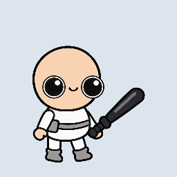
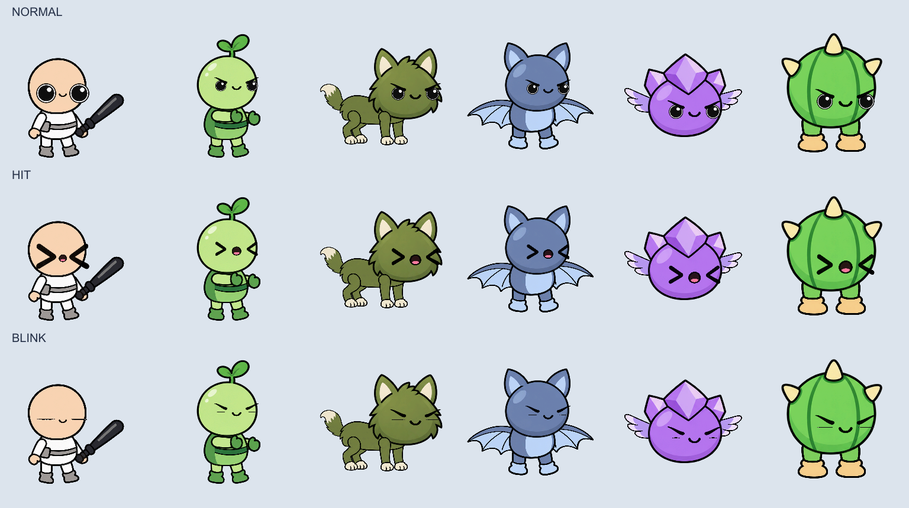
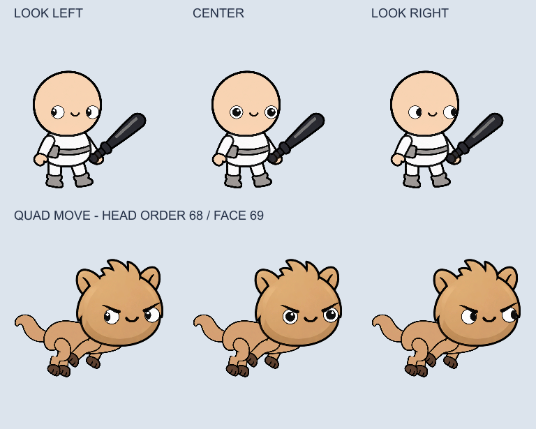
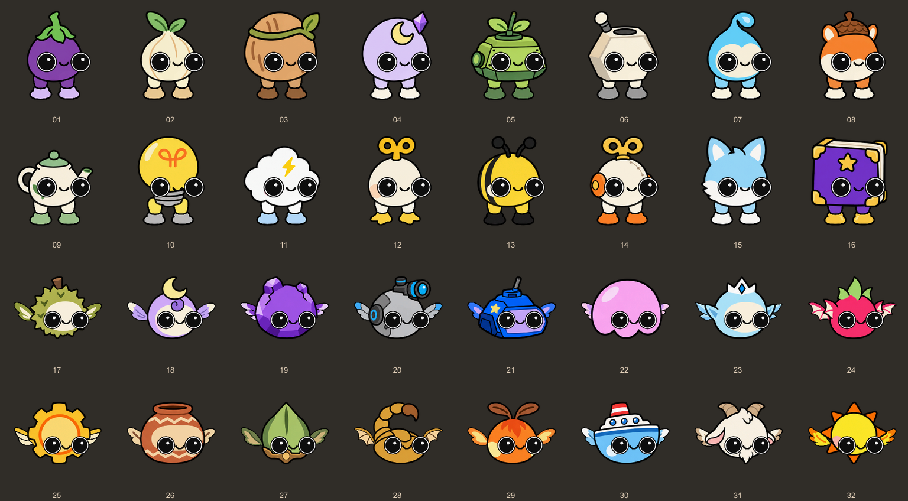

# 분리형 눈·입

플레이어 41종과 적 69종의 머리 PNG/PSB에서 기존 눈·입을 제거했습니다. 동료 32종도 기존 눈·입·코를 제거하고 같은 분리형 눈·입 시스템을 사용합니다. 동료의 머리 형태와 장식은 유지합니다. 4족형 12종과 날개형 15종은 돌출된 주둥이가 없는 둥근 얼굴로 정리했습니다. 머리 외 레이어의 픽셀과 프레임·이름·레이어 ID는 보존했습니다.

## 프리팹에서 위치 조절

`Assets/DoodleIdle/CharacterRigs/Prefabs`의 프리팹을 열고 머리 본 아래 `Face`를 편집합니다. 본 계층은 프리팹마다 다를 수 있습니다.

- `Face`: 눈과 입 전체의 위치·회전·크기.
- `Face/LeftEye`, `Face/RightEye`: 각각의 눈 위치·회전·크기.
- 각 눈의 `EyelidMotion/White`: 흰자 렌더러. 평상시/피격 스프라이트는 `CharacterFace`에서 지정합니다. `EyelidMotion`은 코드가 깜빡임을 처리하는 전용 오브젝트입니다.
- 적의 각 눈 아래 `Brow`: 사나운 눈매를 만드는 별도 눈썹입니다. 위치·크기를 따로 조절할 수 있습니다.
- 각 눈의 `PupilMotion/Pupil`: 눈동자 이미지의 크기·위치. `PupilMotion`은 코드가 시선을 움직이는 전용 오브젝트입니다.
- 각 눈의 `PupilMotion/HighlightMotion/Highlight`: 별도 흰색 반사광입니다. 위치·크기는 `Highlight`에서 조절합니다. `HighlightMotion`은 반사광이 눈동자와 흰자 안쪽에 온전히 남도록 자동 보정합니다.
- 각 눈의 `EyelidMotion/White/PupilMask`: 흰자 안쪽에서 눈동자를 잘라 주는 SpriteMask입니다. 흰자 크기·위치와 눈꺼풀을 따라가며, 각 눈의 SortingGroup으로 다른 눈/캐릭터와 마스크가 섞이지 않습니다.
- `Face/Mouth`: 입의 위치·회전·크기.

외형을 교체해도 편집한 눈·입 앵커 좌표를 덮어쓰지 않습니다. 같은 타입의 캐릭터들은 같은 프리팹 얼굴 배치를 공유합니다. 동료도 분리된 눈과 입을 사용하며 사나운 눈썹만 끕니다. 외형을 다시 적으로 교체하면 적 눈썹도 복구됩니다.

`CharacterFace`의 `Hurt Duration`으로 피격 표정 유지 시간, 각 눈의 `Travel`로 눈동자 이동 한계, `Gaze Speed`로 시선 이동 속도를 조정합니다. `Target`에는 추적할 Transform을 넣습니다. 게임에서는 플레이어와 동료가 가까운 적, 적이 플레이어의 얼굴을 바라보도록 자동 연결합니다.

흰색 반사광에는 마스크를 적용하지 않습니다. 시선을 위나 옆으로 끝까지 움직여도 원이 잘리지 않도록 눈동자와 흰자가 겹치는 영역 안쪽으로 보정합니다. 깜빡여서 눈이 닫히거나 피격 표정일 때는 반사광도 숨깁니다.

눈동자는 흰자 가장자리까지 이동하고, 밖으로 나간 부분은 마스킹됩니다. `Pupil` 크기와 `Travel`을 조정해도 눈 테두리 밖으로 그려지지 않습니다. 얼굴 전체의 SortingGroup은 매 프레임 머리 렌더러의 레이어와 순서+`Sorting Offset`을 따라갑니다. 따라서 4족형 이동처럼 머리 순서가 바뀌는 기존 애니메이션에서도 눈·입이 머리 뒤로 숨지 않습니다. 머리/몸통/팔다리의 기존 순서는 변경하지 않습니다.

## 동작

플레이어는 `Horizontal Gaze Only`를 사용합니다. 양쪽 눈이 같은 좌우 방향을 보고 세로 이동은 하지 않습니다. 타겟이 바로 위·아래에 있거나 사라지면 마지막 좌우 시선을 유지합니다.

스탯·동료·스킨 팝업의 초상화는 오른쪽을 바라봅니다. 스탯은 실제 플레이어 프리팹의 원본 `Idle`을 재생하고 메인 캐릭터의 외형·무기·틴트를 반영합니다. 기본 크기는 기존의 두 배인 248입니다. 스킨 외형은 무기를 숨긴 대기 자세 한 장을 확대해 표시하며, 장착중 표시는 슬롯 중앙에 배치합니다. `Build Popup Portraits` 메뉴로 스킨 이미지를 갱신합니다. 기존 애니메이션 에셋은 수정하지 않습니다.

`Assets/DoodleIdle/Resources/DoodleIdle/UI/PortraitSettings.asset`을 선택하면 Inspector에서 스탯 크기·카메라 확대·좌표, 전투력 간격·너비·글자 크기, 메인 프로필의 얼굴 확대·좌표, PVP 1~3위 크기·발 위치를 조절할 수 있습니다. 플레이 중 변경도 반영됩니다. 메인 프로필은 얼굴을 중심으로 보여주고 외형이나 설정이 바뀔 때만 다시 렌더링합니다.

PVP 팝업 1~3위는 모두 플레이어 리그를 사용하며 기본 크기는 156/140입니다. 각 초상화의 `DoodlePlayerLook`에 외형·무기 아이콘과 틴트를 전달하면 해당 모습으로 표시합니다. 현재 랭킹은 기존 로컬 샘플 데이터이고, 원격 플레이어 데이터는 이후 이 모델에 연결할 수 있습니다.

평상시에는 원형 흰자·원형 검은 눈동자를 사용하며, 적에게는 별도 눈썹으로 사나운 눈매를 적용합니다. 입 주변의 다른 색 패치나 중앙 장식 때문에 눈·입 배치가 제한되던 머리 12종도 정리했습니다.

평상시 깜빡임은 둥근 눈의 눈꺼풀이 빠르게 내려갔다 부드럽게 다시 올라오는 동작입니다. 감은 눈 그림으로 바뀌거나 감은 표정으로 멈춰 있지 않습니다. 눈동자는 원형을 유지하며 좁아지는 눈꺼풀 마스크에 가려집니다. 입과 눈썹은 그대로이고, 질끈 감는 표정은 피격 때만 사용합니다.

피격하지 않아도 2.5~5.5초의 불규칙한 간격으로 0.13초 동안 눈을 깜빡입니다. `Blinking`, `Blink Interval`, `Blink Duration`으로 조절합니다. 깜빡이는 동안 입은 그대로이며, 피격하면 깜빡임을 취소하고 피격 눈·입을 우선 표시합니다. 공격 중 받은 피해에도 얼굴은 반응합니다. 일시정지 중에는 표정 시간과 시선 이동이 멈추고, 풀에 반환하면 표정과 타겟을 초기화합니다. 얼굴 렌더러와 눈썹에도 기존 피격 틴트와 투명도를 적용합니다. 깜빡임은 전투 난수에 영향을 주지 않습니다.

모든 얼굴 파츠는 기존 머리 본을 따라갑니다. 별도의 Animator 레이어나 애니메이션 곡선을 추가하지 않습니다. 기존 `.anim`, `.controller`, `.mask` 파일을 변경하지 않고 기존 본 자세를 유지한 채 스킨 메시를 다시 생성했습니다.

## 이동 먼지

플레이어·적·동료가 사용하는 6개 공용 프리팹에 `CharacterFootDust`와 `GroundContact/FootDust` 파티클 시스템이 있습니다. 발 위치는 `GroundContact`, 먼지 크기·색·수명은 파티클 시스템, 생성 간격은 `CharacterFootDust.Spacing`에서 조절합니다.

실제 이동 거리에 따라 먼지를 경로에 배치하며, 생성된 먼지는 월드 좌표에 남아 사라집니다. 정지 중 애니메이션이나 좌우 반전만으로는 먼지가 나오지 않습니다. 일시정지 때는 파티클도 멈추고, 순간이동이나 풀 재사용 때는 잘못된 긴 궤적을 생성하지 않습니다. 먼지는 그림자 위, 캐릭터 아래 순서로 그립니다. 설치 메뉴는 `Install Foot Dust (Keep Animation)`이며 이미 설정한 프리팹은 보존합니다.

## 에셋과 갱신

분리된 스프라이트는 `Assets/DoodleIdle/Art/CharacterSprites/FaceParts`에 있습니다. 머리 원본은 기존 PNG/PSB 경로를 유지합니다. 이미지 생성은 내장 ImageGen으로 수행했으며 생성 지시문은 `Assets/DoodleIdle/CharacterRigs/Reports/face_generation_prompts.json`에 기록했습니다.

원형 눈·적 눈썹과 머리 색 패치 수정 지시문은 같은 폴더의 `face_refinement_prompts.json`에 기록했습니다.

Unity 메뉴 `Doodle Idle/Character Rigs/Install Separated Faces (Keep Animation)`는 얼굴 컴포넌트를 연결합니다. 이미 있는 얼굴의 위치는 보존합니다. `Render Separated Face Portraits`는 얼굴을 포함한 UI 초상화를 갱신합니다.

PSB 그림을 다시 수정했다면 기존 `Rebuild Selected Skins Keep Prefab Poses`를 사용하세요. **`Build All`과 `Rebuild Prefabs Only`는 애니메이션과 프리팹을 재생성하므로 이 작업에 사용하지 않았습니다.**

반사광 분리와 동료 얼굴 편집 지시문은 `Assets/DoodleIdle/CharacterRigs/Reports/eye_highlight_companion_prompts.json`에 있습니다. 동료도 동일하게 `Face/LeftEye`, `Face/RightEye`, `Face/Mouth`에서 위치를 조정합니다.

## 스킬 소환물의 얼굴

현재 플레이어 배치를 적용한 21개 프레임의 렌더는 `artifacts/skill-faces`에 있습니다.

뱀, 보라 뱀, 얼음 뱀, 톱니 뱀, 용, 강화 용, 지렁이, 흰 구름, 붉은 구름, 드론, 골렘, 불 골렘도 같은 `CharacterFace`를 사용합니다. 원본 스킬 텍스처와 기존 프레임 수·전환 시간·공격 및 이동 로직은 유지하고, 전투 표시에서만 얼굴을 제거한 몸체와 독립된 눈·입을 조합합니다.

`Assets/DoodleIdle/CharacterRigs/SkillFaces`에서 해당 스킬 프리팹을 열면 `LeftEye`, `RightEye`, `Mouth`를 조정할 수 있습니다. 골렘·구름·드론의 프레임별 이동은 부모 `SkillFaceMotion`에 적용하므로 편집한 좌표와 깜빡임 상태가 유지됩니다. 좌우 반전·회전·투명도·렌더 순서·일시정지를 따라가고 가까운 적을 바라봅니다. 오브젝트 풀에 반환하면 표정을 초기화하며, 얼굴이 없는 이펙트로 재사용될 때는 얼굴을 숨깁니다.

12종의 눈·입 사이 간격과 크기 비율은 현재 `Player_Standard` 프리팹과 동일하게 맞췄습니다. 스킬별 얼굴 전체의 위치와 배율만 몸체에 맞춥니다. `Match Skill Faces To Player Layout` 메뉴는 현재 플레이어의 얼굴 배치를 스킬 프리팹에 다시 복사하므로, 스킬에서 따로 조정한 배치를 덮어쓰려는 경우에만 실행합니다.

몸체 그림과 프레임별 기준점은 `Assets/DoodleIdle/Art/SkillFaces`에, 매핑은 `Assets/DoodleIdle/Resources/DoodleIdle/SkillFaceCatalog.asset`에 있습니다. `Build Skill Faces (Keep Animation)` 메뉴는 기존 얼굴 프리팹 배치를 보존합니다. 피격 가능한 소환물을 추가한다면 `DoodleSkillFaceVisual.Face.ShowHit()`으로 같은 피격 눈·입을 표시할 수 있습니다.
